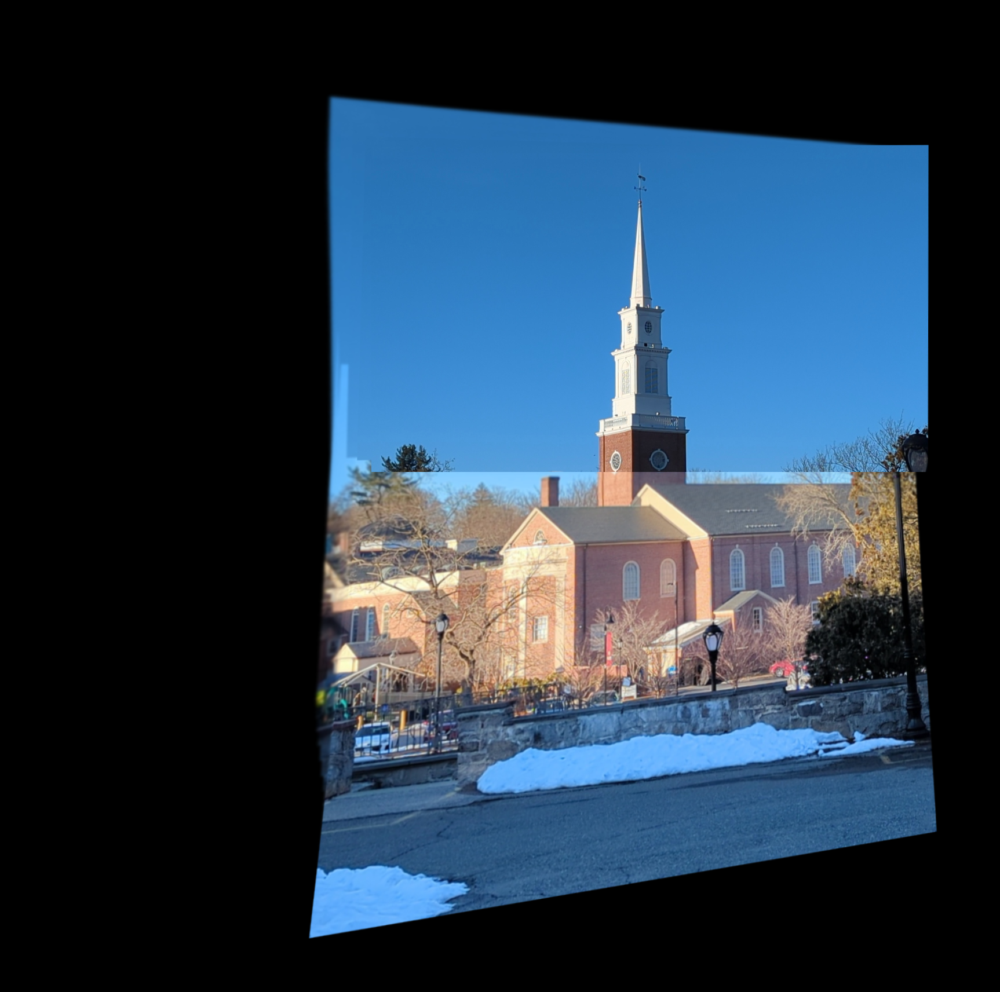

# MyAutoPano - Panorama Image Stitching
RBE/CS Spring 2025: Classical and Deep Learning Approaches for Geometric Computer Vision

MyAutoPano is an end-to-end project that explores panorama stitching using both classical computer vision techniques and modern deep learning approaches. The project is divided into two phases: one focusing on traditional feature-based methods and the other on deep learning-based homography estimation.
## Team Members - Group 19
- Prasham Soni
- Sarthak Mehta

## Project Structure
```
Group19_p1/
└── Phase1/
    └── Code/
        └── wrapper.py
    └── Phase2/
        ├── Code/
        │   ├── Wrapper.py                 # Main wrapper script with switch case for Supervised & Unsupervised
        │   ├── predict_supervised.py       # Supervised model pipeline for homography prediction
        │   ├── predict_unsupervised.py     # Unsupervised model pipeline for homography prediction
        │   ├── CustomDataset.py            # Dataset loading and preprocessing
        │   ├── Train.py                    # Training script for models
        │   ├── Test.py                     # Testing script for evaluation
        ├── Network/
        │   ├── HomographyNet.py             # Supervised deep learning model architecture
        │   ├── Unsupervised_HomographyNet.py # Unsupervised model architecture
        ├── Misc/                            # Additional utility files
        ├── TxtFiles/                        # Configuration and experiment logs

```


---

## Overview

MyAutoPano implements panorama stitching by combining:
- **Phase 1:** Classical feature-based techniques using methods like Harris corner detection, Adaptive Non-Maximal Suppression (ANMS), feature descriptor extraction, feature matching, RANSAC for homography estimation, and image blending.
- **Phase 2:** Deep learning-based homography estimation using both **supervised** and **unsupervised** approaches, where a CNN predicts homography parameters from image patches and refines the prediction using a differentiable warping layer.

---

## **Phase 1: Classical Feature-Based Panorama Stitching**

1. **Corner Detection**  
   - Uses **Harris corner detection** to identify key points in images.

2. **ANMS (Adaptive Non-Maximal Suppression)**  
   - Selects the best corner points ensuring spatial uniformity across the image.

3. **Feature Descriptor & Matching**  
   - Generates feature descriptors (e.g., SIFT) and matches features using the ratio test.

4. **Homography Estimation using RANSAC**  
   - Eliminates outliers and computes a global homography matrix.

5. **Image Warping & Blending**  
   - Applies perspective transformation to warp images and blends them to form a seamless panorama.

**Outputs:**  
- Original example images (50+ images) are provided in `Original_54_images.zip` (downloadable).  
- Example panorama output:  
  <p align="center">
    
    <br/>
    <em>Generated panorama using the classical approach</em>
  </p>

---

## **Phase 2: Deep Learning-Based Homography Estimation**

### ✅ **Supervised Learning Approach**
- The **Supervised Homography Network** (in `HomographyNet.py`) is trained on **128×128 patches**.
- The model predicts 4-point displacement vectors (H4Pt) which are then converted into a full homography matrix using Direct Linear Transformation (DLT).
- Predicted homographies are applied patch-wise, which may introduce some local alignment inconsistencies.

### 🤖 **Unsupervised Learning Approach**
- The **Unsupervised Homography Network** (in `Unsupervised_HomographyNet.py`) directly predicts the homography matrix (H_pred) in an end-to-end manner.
- A self-supervised loss function minimizes the difference between the warped image and the target image.
- While the approach produces overlapping images, training can be challenging as the loss function may not stabilize.

---

## ** Phase 2: Deep Learning:Algorithm Pipeline**

### **Supervised Learning Pipeline**
1. **Patch Extraction**  
   - Extracts 128×128 patches from the images.
2. **CNN-Based Homography Prediction**  
   - Predicts H4Pt displacements from which the homography matrix is computed using DLT.
3. **Warping & Blending**  
   - Applies the predicted homographies to warp patches and blends them to construct the final panorama.

### **Unsupervised Learning Pipeline**
1. **Feature Learning Without Ground Truth**  
   - Directly estimates the homography matrix from image patches using CNN.
2. **Image Warping**  
   - Warps one image onto another using the predicted homography.
3. **Blending & Panorama Stitching**  
   - Merges images using weighted blending. Note: The unsupervised model may struggle with alignment stability.

---

## **Requirements**

- Python 3.x  
- OpenCV (`cv2`)  
- NumPy  
- PyTorch  
- Matplotlib  

*Ensure you have the correct versions installed for compatibility.*

---

## **Usage**

1. **Input Data:**  
   - Place your input images in the appropriate directory (e.g., `Data/Test/`).

2. **Phase 1 - Classical Stitching:**  
   Run the classical stitching pipeline:
   ```bash
   python Phase1/Code/wrapper.py --input_dir "Data/Test/" --output "Output/final_panorama.jpg"

2. **Phase 2 - Deep Learning Homography Estimation:**  
   Switch Between Approaches:

      The main wrapper script (Phase2/Code/Wrapper.py) allows you to choose between supervised and unsupervised methods via command-line arguments.
      Training:
   ```bash
      python Phase2/Code/Train.py --ModelType supervised  # or "unsupervised"

